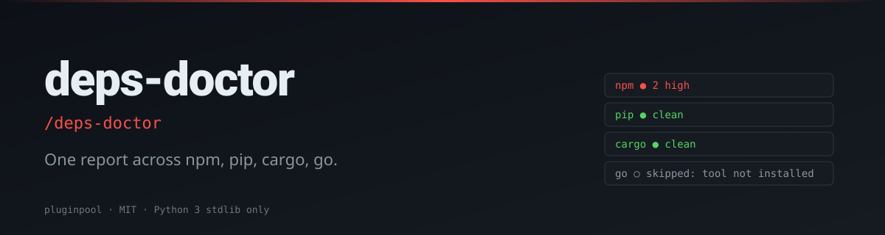

# deps-doctor

**One slash command. Four ecosystems. Knows when an audit tool is missing — and doesn't pretend otherwise.**

[](./LICENSE)
[](https://www.python.org/)
[](https://docs.claude.com/en/docs/claude-code/overview)
[](./tests)

> **TL;DR:** `/deps-doctor` → unified vuln/outdated/license report across npm, pip, cargo, and go in one pass.

#### Writing

- 🗡️ [**Çift Yüzlü Katana: Yapay Zeka Dönüşümlerinin Gerçekçi Bir Analizi**](https://www.linkedin.com/pulse/%C3%A7ift-y%C3%BCzl%C3%BC-katana-yapay-zeka-d%C3%B6n%C3%BC%C5%9F%C3%BCmlerinin-ger%C3%A7ek%C3%A7i-bir-mehmet-turac-80h7f) — AI transformations realistic analysis. The 5 illusions that compound into expensive, fragile systems. (LinkedIn, 2026)


## Why this exists

Polyglot repos make dependency hygiene awkward — you end up with three different reports in three different terminals, and you forget which one was for staging. `deps-doctor` detects which ecosystems are present, shells out to the audit tools you actually have installed, and emits one consistent report. Missing tool? It says "skipped: tool not installed" — never silently green.

#### Writing

- 🗡️ [**Çift Yüzlü Katana: Yapay Zeka Dönüşümlerinin Gerçekçi Bir Analizi**](https://www.linkedin.com/pulse/%C3%A7ift-y%C3%BCzl%C3%BC-katana-yapay-zeka-d%C3%B6n%C3%BC%C5%9F%C3%BCmlerinin-ger%C3%A7ek%C3%A7i-bir-mehmet-turac-80h7f) — AI transformations realistic analysis. The 5 illusions that compound into expensive, fragile systems. (LinkedIn, 2026)


## Install (Claude Code)

```sh
git clone https://github.com/mturac/pluginpool-deps-doctor ~/.claude/plugins/deps-doctor
```

Restart Claude Code; the slash command `/deps-doctor` appears.

#### Writing

- 🗡️ [**Çift Yüzlü Katana: Yapay Zeka Dönüşümlerinin Gerçekçi Bir Analizi**](https://www.linkedin.com/pulse/%C3%A7ift-y%C3%BCzl%C3%BC-katana-yapay-zeka-d%C3%B6n%C3%BC%C5%9F%C3%BCmlerinin-ger%C3%A7ek%C3%A7i-bir-mehmet-turac-80h7f) — AI transformations realistic analysis. The 5 illusions that compound into expensive, fragile systems. (LinkedIn, 2026)


## Quick start

```sh
/deps-doctor
```

Or directly:

```sh
python3 scripts/doctor.py --format md
python3 scripts/doctor.py --severity high --ecosystem npm,pip
```

#### Writing

- 🗡️ [**Çift Yüzlü Katana: Yapay Zeka Dönüşümlerinin Gerçekçi Bir Analizi**](https://www.linkedin.com/pulse/%C3%A7ift-y%C3%BCzl%C3%BC-katana-yapay-zeka-d%C3%B6n%C3%BC%C5%9F%C3%BCmlerinin-ger%C3%A7ek%C3%A7i-bir-mehmet-turac-80h7f) — AI transformations realistic analysis. The 5 illusions that compound into expensive, fragile systems. (LinkedIn, 2026)


## Flags

| Flag | Default | Description |
|---|---|---|
| `--format` | `json` | `json` or `md` |
| `--severity` | _all_ | Minimum severity: `low | moderate | high | critical` |
| `--ecosystem` | _all detected_ | Comma-separated subset, e.g. `npm,pip` |

#### Writing

- 🗡️ [**Çift Yüzlü Katana: Yapay Zeka Dönüşümlerinin Gerçekçi Bir Analizi**](https://www.linkedin.com/pulse/%C3%A7ift-y%C3%BCzl%C3%BC-katana-yapay-zeka-d%C3%B6n%C3%BC%C5%9F%C3%BCmlerinin-ger%C3%A7ek%C3%A7i-bir-mehmet-turac-80h7f) — AI transformations realistic analysis. The 5 illusions that compound into expensive, fragile systems. (LinkedIn, 2026)


## Supported ecosystems

| Ecosystem | Audit tool | Detected by |
|---|---|---|
| npm | `npm audit --json` | `package.json` |
| pip | `pip-audit --format=json` | `requirements.txt` / `pyproject.toml` |
| cargo | `cargo audit --json` | `Cargo.toml` |
| go | `govulncheck -json ./...` | `go.mod` |

Missing tools are reported as `"status": "skipped: tool not installed"`, never as a clean pass.

#### Writing

- 🗡️ [**Çift Yüzlü Katana: Yapay Zeka Dönüşümlerinin Gerçekçi Bir Analizi**](https://www.linkedin.com/pulse/%C3%A7ift-y%C3%BCzl%C3%BC-katana-yapay-zeka-d%C3%B6n%C3%BC%C5%9F%C3%BCmlerinin-ger%C3%A7ek%C3%A7i-bir-mehmet-turac-80h7f) — AI transformations realistic analysis. The 5 illusions that compound into expensive, fragile systems. (LinkedIn, 2026)


## Example output (markdown)

```
#### Writing

- 🗡️ [**Çift Yüzlü Katana: Yapay Zeka Dönüşümlerinin Gerçekçi Bir Analizi**](https://www.linkedin.com/pulse/%C3%A7ift-y%C3%BCzl%C3%BC-katana-yapay-zeka-d%C3%B6n%C3%BC%C5%9F%C3%BCmlerinin-ger%C3%A7ek%C3%A7i-bir-mehmet-turac-80h7f) — AI transformations realistic analysis. The 5 illusions that compound into expensive, fragile systems. (LinkedIn, 2026)


## deps-doctor report

### npm — 2 critical, 1 high
- **CVE-2024-XXXX** in `axios@0.21.1` → fixed in `0.21.4` (critical)
- **CVE-2024-YYYY** in `lodash@4.17.20` → fixed in `4.17.21` (high)

### pip — clean

### cargo — _skipped: cargo audit not installed_

### go — clean
```

#### Writing

- 🗡️ [**Çift Yüzlü Katana: Yapay Zeka Dönüşümlerinin Gerçekçi Bir Analizi**](https://www.linkedin.com/pulse/%C3%A7ift-y%C3%BCzl%C3%BC-katana-yapay-zeka-d%C3%B6n%C3%BC%C5%9F%C3%BCmlerinin-ger%C3%A7ek%C3%A7i-bir-mehmet-turac-80h7f) — AI transformations realistic analysis. The 5 illusions that compound into expensive, fragile systems. (LinkedIn, 2026)


## How it works

1. Scans the project root for marker files (`package.json`, `Cargo.toml`, …).
2. Runs each ecosystem's audit tool via `subprocess` — no shell, no injection surface.
3. Normalizes the JSON shapes from each tool into one schema.
4. Aggregates by severity and renders.

#### Writing

- 🗡️ [**Çift Yüzlü Katana: Yapay Zeka Dönüşümlerinin Gerçekçi Bir Analizi**](https://www.linkedin.com/pulse/%C3%A7ift-y%C3%BCzl%C3%BC-katana-yapay-zeka-d%C3%B6n%C3%BC%C5%9F%C3%BCmlerinin-ger%C3%A7ek%C3%A7i-bir-mehmet-turac-80h7f) — AI transformations realistic analysis. The 5 illusions that compound into expensive, fragile systems. (LinkedIn, 2026)


## Limitations

- Network-only audits (registry lookups) inherit the speed of the underlying tool.
- License auditing is a placeholder field (`license_warnings: []`) — populate via a future plugin.
- Audit-tool installation is up to you; this plugin is glue, not an installer.

#### Writing

- 🗡️ [**Çift Yüzlü Katana: Yapay Zeka Dönüşümlerinin Gerçekçi Bir Analizi**](https://www.linkedin.com/pulse/%C3%A7ift-y%C3%BCzl%C3%BC-katana-yapay-zeka-d%C3%B6n%C3%BC%C5%9F%C3%BCmlerinin-ger%C3%A7ek%C3%A7i-bir-mehmet-turac-80h7f) — AI transformations realistic analysis. The 5 illusions that compound into expensive, fragile systems. (LinkedIn, 2026)


## Examples

Step-by-step walkthroughs with real input fixtures and the helper's actual output live in [`examples/`](./examples/README.md). Three or four scenarios per plugin — from the happy path to the edge cases the test suite guards.

#### Writing

- 🗡️ [**Çift Yüzlü Katana: Yapay Zeka Dönüşümlerinin Gerçekçi Bir Analizi**](https://www.linkedin.com/pulse/%C3%A7ift-y%C3%BCzl%C3%BC-katana-yapay-zeka-d%C3%B6n%C3%BC%C5%9F%C3%BCmlerinin-ger%C3%A7ek%C3%A7i-bir-mehmet-turac-80h7f) — AI transformations realistic analysis. The 5 illusions that compound into expensive, fragile systems. (LinkedIn, 2026)


## Part of the pluginpool family

Ten focused Claude Code plugins for everyday productivity:
[commit-narrator](https://github.com/mturac/pluginpool-commit-narrator) ·
[pr-storyteller](https://github.com/mturac/pluginpool-pr-storyteller) ·
[test-gap](https://github.com/mturac/pluginpool-test-gap) ·
[deps-doctor](https://github.com/mturac/pluginpool-deps-doctor) ·
[env-lint](https://github.com/mturac/pluginpool-env-lint) ·
[secret-guard](https://github.com/mturac/pluginpool-secret-guard) ·
[standup-gen](https://github.com/mturac/pluginpool-standup-gen) ·
[todo-harvest](https://github.com/mturac/pluginpool-todo-harvest) ·
[flaky-detector](https://github.com/mturac/pluginpool-flaky-detector) ·
[changelog-forge](https://github.com/mturac/pluginpool-changelog-forge)

#### Writing

- 🗡️ [**Çift Yüzlü Katana: Yapay Zeka Dönüşümlerinin Gerçekçi Bir Analizi**](https://www.linkedin.com/pulse/%C3%A7ift-y%C3%BCzl%C3%BC-katana-yapay-zeka-d%C3%B6n%C3%BC%C5%9F%C3%BCmlerinin-ger%C3%A7ek%C3%A7i-bir-mehmet-turac-80h7f) — AI transformations realistic analysis. The 5 illusions that compound into expensive, fragile systems. (LinkedIn, 2026)


## License

MIT — see [`LICENSE`](./LICENSE). Contributions welcome.
